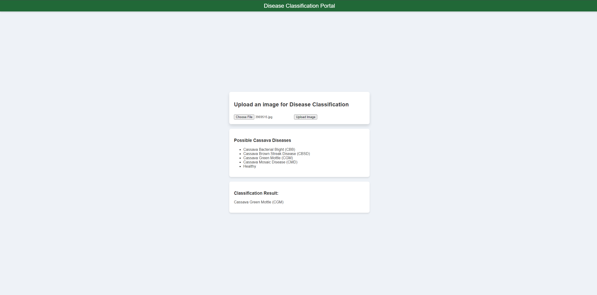

# Plant Disease Classification Flask App

This Flask application allows users to upload images of cassava leaves and classifies the images into one of several disease categories. The categories include:
1. Cassava Bacterial Blight (CBB)
2. Cassava Brown Streak Disease (CBSD)
3. Cassava Green Mottle (CGM)
4. Cassava Mosaic Disease (CMD)
5. Healthy

## Requirements

- Python 3.x
- Flask
- Other dependencies specified in `requirements.txt`

## Setup

1. **Clone the repository:**

    ```bash
    git clone https://github.com/yourusername/plant-disease-classification.git
    cd plant-disease-classification
    ```

2. **Run the Flask application:**

    ```bash
    python app.py
    ```

3. **Access the application:**

    Open a web browser and go to `http://127.0.0.1:5000/`.

## Usage

1. Navigate to the home page.
2. Upload an image of a cassava leaf using the file upload form.
3. The application will process the image and return the classification result.

## GUI Example



## File Structure

```
plant-disease-classification/
│
├── app.py
├── demo.py
├── templates/
│   └── home.html
├── uploads/
└── README.md
```

## demo.py

The `demo.py` file contains the `PlantDiseaseClassification` class which is responsible for loading the trained model and classifying the uploaded images.

## Notes

- Ensure the model file is present in the appropriate directory as required by the `PlantDiseaseClassification` class.
- The maximum file size for uploads is set to 16 MB. You can adjust this by modifying the `MAX_CONTENT_LENGTH` configuration in `app.py`.
